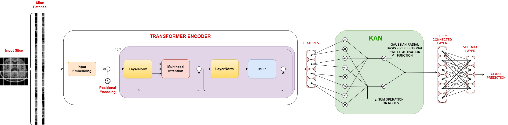
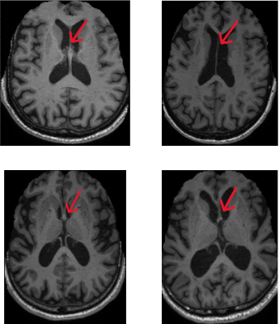

# DINOv2-KAN: Distillation with No Labels v2 and Kolmogorov-Arnold Network for Enhanced MRI-Based Diagnosis of Alzheimer’s Disease

This repository contains the implementation and resources for **DINOv2-KAN**, a hybrid deep learning framework that combines the DINOv2 Vision Transformer (ViT) and Kolmogorov-Arnold Network (KAN) for MRI-based diagnosis of Alzheimer’s Disease (AD) with high accuracy.

## Overview

Alzheimer’s Disease (AD) is a progressive neurodegenerative disorder that affects memory and cognition. Early and precise diagnosis is crucial for effective treatment, but traditional approaches often fail to capture subtle changes at different disease stages. **DINOv2-KAN** tackles these diagnostic challenges by integrating:
- **DINOv2 Vision Transformer (ViT)** to extract detailed feature representations from MRI scans.
- **Kolmogorov-Arnold Network (KAN)** to transform these features into robust representations for enhanced classification.

This hybrid model is trained with **supervised contrastive learning** to further improve classification accuracy. Extensive experiments on the ADNI, OASIS, and Kaggle datasets demonstrate its superior performance, achieving:
- **99.11% ± 0.25% accuracy** for Alzheimer’s Disease vs. Non-Cognitively Impaired classification.
- **99.37% ± 0.40% accuracy** for a four-class classification (AD, Non-Cognitively Impaired, Early Mild Cognitive Impairment, Mild Cognitive Impairment) on the ADNI dataset.

These results, validated on additional datasets, show statistically significant improvements over state-of-the-art methods.

## Table of Contents

- [Introduction](#introduction)
- [Repository Structure](#repository-structure)
- [Competing Models](#competing-models)
- [Proposed Model](#proposed-model)
- [Getting Started](#getting-started)
- [MRI Image Samples](#mri-image-samples)
- [Dataset Split Information](#dataset-split-information)
- [CSV File Structure](CSV-File-Structure)
- [Contributing](#contributing)
- [License](#license)

## Introduction

Alzheimer's disease (AD) is a progressive neurodegenerative disorder that affects millions of individuals worldwide. Early detection and accurate diagnosis are crucial for effective intervention. This work explores various deep learning models to enhance the accuracy of Alzheimer’s disease prediction using medical imaging data.

## Repository Structure
```md
Alzheimer-disease-prediction/
├── MODELS/
│   └── COMPETING MODELS/
│       ├── Alznet.ipynb
│       ├── HTLML.ipynb
│       ├── Modified Alexnet.ipynb
│       ├── Modified Inception.ipynb
│       ├── Resnet18.ipynb
│       ├── Resnet50.ipynb
│       ├── VGG16.ipynb
│       ├── VGG19.ipynb
│       └── ViTBiLSTM.ipynb
├── PROPOSED MODEL/
│   └── Dinov2KAN.ipynb
├── Splits/
│   ├── kaggledataset_split.csv
│   ├── oasisdataset_split.csv
│   └── adnidataset_split.csv
└── Images/
    └── Representative_Slices.png
    └── Final_Elaborated_Block_Diagram.png


```
### Competing Models

The `COMPETING MODELS` folder includes various well-known deep learning architectures that have been utilized to predict Alzheimer’s disease. Each model is implemented in a Jupyter Notebook and can be executed independently.

### Proposed Model

The `PROPOSED MODEL` folder features the **DINOv2-KAN** hybrid model, which combines vision transformers with Kolmogorov-Arnold Networks to enhance predictive performance. This notebook outlines the architecture, training process, and evaluation metrics.

## Getting Started

To get started with this repository:

1. **Clone the repository:**
   ```bash
   git clone https://github.com/yourusername/Alzheimer-disease-prediction.git
   cd Alzheimer-disease-prediction

2. **Install the required dependencies:** 
   Make sure you have Python and pip installed, then run:
   ```bash
    pip install -r requirements.txt
3. **Run the notebooks:** 
   Open Jupyter Notebook or JupyterLab, navigate to the desired model's notebook, and execute the cells to train and evaluate the model.

## MRI Image Samples



## Dataset Split Information

To ensure consistent evaluation across experiments, we provide pre-defined five-fold splits for each of the datasets used in this study. Each split is stored in a CSV file detailing which files belong to the training or testing sets in each fold.

### CSV File Structure
Each CSV file contains the following columns:

- **file_name**: The unique identifier or file name of the MRI slice/image.
- **set**: Specifies whether the file is part of the "train" or "test" set for the given fold.
- **class**: The class label associated with the file, indicating its condition (e.g., AD, CN, MCI).
   
## Contributing

We welcome contributions to improve this project. If you have suggestions or enhancements, please create an issue or submit a pull request.

## License
This project is licensed under the MIT License - see the LICENSE file for details.


